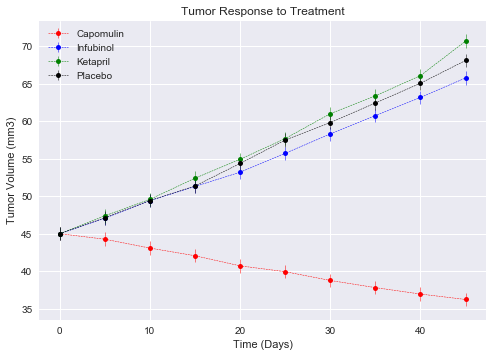
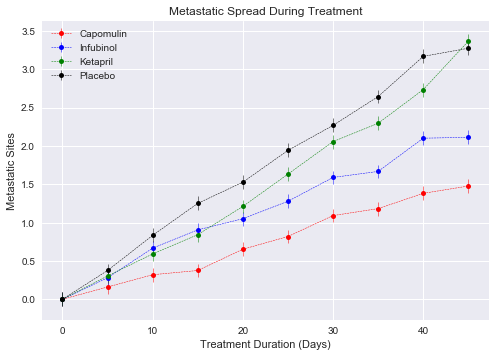
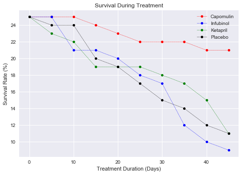
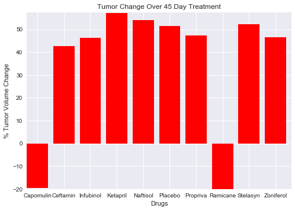

```python
# Dependencies
import matplotlib.pyplot as plt
import numpy as np
import pandas as pd
import seaborn as sns
```


```python
# Read CSV
trial_data = pd.read_csv("RawData/clinicaltrial_data.csv")
drug_data = pd.read_csv("RawData/mouse_drug_data.csv")
```


```python
trial_data.head()
```


<div>
<style>
    .dataframe thead tr:only-child th {
        text-align: right;
    }

    .dataframe thead th {
        text-align: left;
    }

    .dataframe tbody tr th {
        vertical-align: top;
    }
</style>
<table border="1" class="dataframe">
  <thead>
    <tr style="text-align: right;">
      <th></th>
      <th>Mouse ID</th>
      <th>Timepoint</th>
      <th>Tumor Volume (mm3)</th>
      <th>Metastatic Sites</th>
    </tr>
  </thead>
  <tbody>
    <tr>
      <th>0</th>
      <td>b128</td>
      <td>0</td>
      <td>45.0</td>
      <td>0</td>
    </tr>
    <tr>
      <th>1</th>
      <td>f932</td>
      <td>0</td>
      <td>45.0</td>
      <td>0</td>
    </tr>
    <tr>
      <th>2</th>
      <td>g107</td>
      <td>0</td>
      <td>45.0</td>
      <td>0</td>
    </tr>
    <tr>
      <th>3</th>
      <td>a457</td>
      <td>0</td>
      <td>45.0</td>
      <td>0</td>
    </tr>
    <tr>
      <th>4</th>
      <td>c819</td>
      <td>0</td>
      <td>45.0</td>
      <td>0</td>
    </tr>
  </tbody>
</table>
</div>


```python
drug_data.head()
```


<div>
<style>
    .dataframe thead tr:only-child th {
        text-align: right;
    }

    .dataframe thead th {
        text-align: left;
    }

    .dataframe tbody tr th {
        vertical-align: top;
    }
</style>
<table border="1" class="dataframe">
  <thead>
    <tr style="text-align: right;">
      <th></th>
      <th>Mouse ID</th>
      <th>Drug</th>
    </tr>
  </thead>
  <tbody>
    <tr>
      <th>0</th>
      <td>f234</td>
      <td>Stelasyn</td>
    </tr>
    <tr>
      <th>1</th>
      <td>x402</td>
      <td>Stelasyn</td>
    </tr>
    <tr>
      <th>2</th>
      <td>a492</td>
      <td>Stelasyn</td>
    </tr>
    <tr>
      <th>3</th>
      <td>w540</td>
      <td>Stelasyn</td>
    </tr>
    <tr>
      <th>4</th>
      <td>v764</td>
      <td>Stelasyn</td>
    </tr>
  </tbody>
</table>
</div>


```python
# Merge two data frames
drug_trial_data = trial_data.merge(drug_data, on = 'Mouse ID', how = 'outer')
drug_trial_data.head()
```


<div>
<style>
    .dataframe thead tr:only-child th {
        text-align: right;
    }

    .dataframe thead th {
        text-align: left;
    }

    .dataframe tbody tr th {
        vertical-align: top;
    }
</style>
<table border="1" class="dataframe">
  <thead>
    <tr style="text-align: right;">
      <th></th>
      <th>Mouse ID</th>
      <th>Timepoint</th>
      <th>Tumor Volume (mm3)</th>
      <th>Metastatic Sites</th>
      <th>Drug</th>
    </tr>
  </thead>
  <tbody>
    <tr>
      <th>0</th>
      <td>b128</td>
      <td>0</td>
      <td>45.000000</td>
      <td>0</td>
      <td>Capomulin</td>
    </tr>
    <tr>
      <th>1</th>
      <td>b128</td>
      <td>5</td>
      <td>45.651331</td>
      <td>0</td>
      <td>Capomulin</td>
    </tr>
    <tr>
      <th>2</th>
      <td>b128</td>
      <td>10</td>
      <td>43.270852</td>
      <td>0</td>
      <td>Capomulin</td>
    </tr>
    <tr>
      <th>3</th>
      <td>b128</td>
      <td>15</td>
      <td>43.784893</td>
      <td>0</td>
      <td>Capomulin</td>
    </tr>
    <tr>
      <th>4</th>
      <td>b128</td>
      <td>20</td>
      <td>42.731552</td>
      <td>0</td>
      <td>Capomulin</td>
    </tr>
  </tbody>
</table>
</div>


# Tumor Response to Treatment


```python
# Select required columns for analysis
tumor_response_df = drug_trial_data[['Drug', 'Timepoint', 'Tumor Volume (mm3)']]

# Calculate mean of Tumor Volume per drug
tumor_response_df = pd.DataFrame(tumor_response_df.groupby(['Drug', 'Timepoint'])['Tumor Volume (mm3)'].mean())

# Calculate standard error for Tumor Volume
tumor_response_df["Volume SEM"] = tumor_response_df['Tumor Volume (mm3)'].sem()
tumor_response_df.reset_index(inplace = True)
tumor_response_df.head()
```


<div>
<style>
    .dataframe thead tr:only-child th {
        text-align: right;
    }

    .dataframe thead th {
        text-align: left;
    }

    .dataframe tbody tr th {
        vertical-align: top;
    }
</style>
<table border="1" class="dataframe">
  <thead>
    <tr style="text-align: right;">
      <th></th>
      <th>Drug</th>
      <th>Timepoint</th>
      <th>Tumor Volume (mm3)</th>
      <th>Volume SEM</th>
    </tr>
  </thead>
  <tbody>
    <tr>
      <th>0</th>
      <td>Capomulin</td>
      <td>0</td>
      <td>45.000000</td>
      <td>0.898067</td>
    </tr>
    <tr>
      <th>1</th>
      <td>Capomulin</td>
      <td>5</td>
      <td>44.266086</td>
      <td>0.898067</td>
    </tr>
    <tr>
      <th>2</th>
      <td>Capomulin</td>
      <td>10</td>
      <td>43.084291</td>
      <td>0.898067</td>
    </tr>
    <tr>
      <th>3</th>
      <td>Capomulin</td>
      <td>15</td>
      <td>42.064317</td>
      <td>0.898067</td>
    </tr>
    <tr>
      <th>4</th>
      <td>Capomulin</td>
      <td>20</td>
      <td>40.716325</td>
      <td>0.898067</td>
    </tr>
  </tbody>
</table>
</div>


```python
# Reshaping the Tumor Volume data frame using Pivot Table
tumor_response_pivot = tumor_response_df.pivot_table(index='Timepoint',columns='Drug',values='Tumor Volume (mm3)')  
tumor_response_pivot.head()
```


<div>
<style>
    .dataframe thead tr:only-child th {
        text-align: right;
    }

    .dataframe thead th {
        text-align: left;
    }

    .dataframe tbody tr th {
        vertical-align: top;
    }
</style>
<table border="1" class="dataframe">
  <thead>
    <tr style="text-align: right;">
      <th>Drug</th>
      <th>Capomulin</th>
      <th>Ceftamin</th>
      <th>Infubinol</th>
      <th>Ketapril</th>
      <th>Naftisol</th>
      <th>Placebo</th>
      <th>Propriva</th>
      <th>Ramicane</th>
      <th>Stelasyn</th>
      <th>Zoniferol</th>
    </tr>
    <tr>
      <th>Timepoint</th>
      <th></th>
      <th></th>
      <th></th>
      <th></th>
      <th></th>
      <th></th>
      <th></th>
      <th></th>
      <th></th>
      <th></th>
    </tr>
  </thead>
  <tbody>
    <tr>
      <th>0</th>
      <td>45.000000</td>
      <td>45.000000</td>
      <td>45.000000</td>
      <td>45.000000</td>
      <td>45.000000</td>
      <td>45.000000</td>
      <td>45.000000</td>
      <td>45.000000</td>
      <td>45.000000</td>
      <td>45.000000</td>
    </tr>
    <tr>
      <th>5</th>
      <td>44.266086</td>
      <td>46.503051</td>
      <td>47.062001</td>
      <td>47.389175</td>
      <td>46.796098</td>
      <td>47.125589</td>
      <td>47.248967</td>
      <td>43.944859</td>
      <td>47.527452</td>
      <td>46.851818</td>
    </tr>
    <tr>
      <th>10</th>
      <td>43.084291</td>
      <td>48.285125</td>
      <td>49.403909</td>
      <td>49.582269</td>
      <td>48.694210</td>
      <td>49.423329</td>
      <td>49.101541</td>
      <td>42.531957</td>
      <td>49.463844</td>
      <td>48.689881</td>
    </tr>
    <tr>
      <th>15</th>
      <td>42.064317</td>
      <td>50.094055</td>
      <td>51.296397</td>
      <td>52.399974</td>
      <td>50.933018</td>
      <td>51.359742</td>
      <td>51.067318</td>
      <td>41.495061</td>
      <td>51.529409</td>
      <td>50.779059</td>
    </tr>
    <tr>
      <th>20</th>
      <td>40.716325</td>
      <td>52.157049</td>
      <td>53.197691</td>
      <td>54.920935</td>
      <td>53.644087</td>
      <td>54.364417</td>
      <td>53.346737</td>
      <td>40.238325</td>
      <td>54.067395</td>
      <td>53.170334</td>
    </tr>
  </tbody>
</table>
</div>


```python
# Reshaping the Volume SEM data frame using Pivot Table
tumor_response_sem_pivot = tumor_response_df.pivot_table(index='Timepoint',columns='Drug',values='Volume SEM')  
tumor_response_sem_pivot
```


<div>
<style>
    .dataframe thead tr:only-child th {
        text-align: right;
    }

    .dataframe thead th {
        text-align: left;
    }

    .dataframe tbody tr th {
        vertical-align: top;
    }
</style>
<table border="1" class="dataframe">
  <thead>
    <tr style="text-align: right;">
      <th>Drug</th>
      <th>Capomulin</th>
      <th>Ceftamin</th>
      <th>Infubinol</th>
      <th>Ketapril</th>
      <th>Naftisol</th>
      <th>Placebo</th>
      <th>Propriva</th>
      <th>Ramicane</th>
      <th>Stelasyn</th>
      <th>Zoniferol</th>
    </tr>
    <tr>
      <th>Timepoint</th>
      <th></th>
      <th></th>
      <th></th>
      <th></th>
      <th></th>
      <th></th>
      <th></th>
      <th></th>
      <th></th>
      <th></th>
    </tr>
  </thead>
  <tbody>
    <tr>
      <th>0</th>
      <td>0.898067</td>
      <td>0.898067</td>
      <td>0.898067</td>
      <td>0.898067</td>
      <td>0.898067</td>
      <td>0.898067</td>
      <td>0.898067</td>
      <td>0.898067</td>
      <td>0.898067</td>
      <td>0.898067</td>
    </tr>
    <tr>
      <th>5</th>
      <td>0.898067</td>
      <td>0.898067</td>
      <td>0.898067</td>
      <td>0.898067</td>
      <td>0.898067</td>
      <td>0.898067</td>
      <td>0.898067</td>
      <td>0.898067</td>
      <td>0.898067</td>
      <td>0.898067</td>
    </tr>
    <tr>
      <th>10</th>
      <td>0.898067</td>
      <td>0.898067</td>
      <td>0.898067</td>
      <td>0.898067</td>
      <td>0.898067</td>
      <td>0.898067</td>
      <td>0.898067</td>
      <td>0.898067</td>
      <td>0.898067</td>
      <td>0.898067</td>
    </tr>
    <tr>
      <th>15</th>
      <td>0.898067</td>
      <td>0.898067</td>
      <td>0.898067</td>
      <td>0.898067</td>
      <td>0.898067</td>
      <td>0.898067</td>
      <td>0.898067</td>
      <td>0.898067</td>
      <td>0.898067</td>
      <td>0.898067</td>
    </tr>
    <tr>
      <th>20</th>
      <td>0.898067</td>
      <td>0.898067</td>
      <td>0.898067</td>
      <td>0.898067</td>
      <td>0.898067</td>
      <td>0.898067</td>
      <td>0.898067</td>
      <td>0.898067</td>
      <td>0.898067</td>
      <td>0.898067</td>
    </tr>
    <tr>
      <th>25</th>
      <td>0.898067</td>
      <td>0.898067</td>
      <td>0.898067</td>
      <td>0.898067</td>
      <td>0.898067</td>
      <td>0.898067</td>
      <td>0.898067</td>
      <td>0.898067</td>
      <td>0.898067</td>
      <td>0.898067</td>
    </tr>
    <tr>
      <th>30</th>
      <td>0.898067</td>
      <td>0.898067</td>
      <td>0.898067</td>
      <td>0.898067</td>
      <td>0.898067</td>
      <td>0.898067</td>
      <td>0.898067</td>
      <td>0.898067</td>
      <td>0.898067</td>
      <td>0.898067</td>
    </tr>
    <tr>
      <th>35</th>
      <td>0.898067</td>
      <td>0.898067</td>
      <td>0.898067</td>
      <td>0.898067</td>
      <td>0.898067</td>
      <td>0.898067</td>
      <td>0.898067</td>
      <td>0.898067</td>
      <td>0.898067</td>
      <td>0.898067</td>
    </tr>
    <tr>
      <th>40</th>
      <td>0.898067</td>
      <td>0.898067</td>
      <td>0.898067</td>
      <td>0.898067</td>
      <td>0.898067</td>
      <td>0.898067</td>
      <td>0.898067</td>
      <td>0.898067</td>
      <td>0.898067</td>
      <td>0.898067</td>
    </tr>
    <tr>
      <th>45</th>
      <td>0.898067</td>
      <td>0.898067</td>
      <td>0.898067</td>
      <td>0.898067</td>
      <td>0.898067</td>
      <td>0.898067</td>
      <td>0.898067</td>
      <td>0.898067</td>
      <td>0.898067</td>
      <td>0.898067</td>
    </tr>
  </tbody>
</table>
</div>


```python
plt.errorbar(tumor_response_pivot.index, tumor_response_pivot['Capomulin'], yerr=tumor_response_sem_pivot['Capomulin'],
             color='r', marker='o', markersize=5, linestyle='--', linewidth=0.5)

plt.errorbar(tumor_response_pivot.index, tumor_response_pivot['Infubinol'], yerr=tumor_response_sem_pivot['Infubinol'],
             color='b', marker='o', markersize=5, linestyle='--', linewidth=0.5)

plt.errorbar(tumor_response_pivot.index, tumor_response_pivot['Ketapril'], yerr=tumor_response_sem_pivot['Ketapril'],
             color='g', marker='o', markersize=5, linestyle='--', linewidth=0.5)

plt.errorbar(tumor_response_pivot.index, tumor_response_pivot['Placebo'], yerr=tumor_response_sem_pivot['Placebo'],
             color='black', marker='o', markersize=5, linestyle='--', linewidth=0.5)

x_lim = len(tumor_response_pivot.index)
# Chart title
plt.title("Tumor Response to Treatment")
# x label
plt.xlabel("Time (Days)")
# y label
plt.ylabel("Tumor Volume (mm3)")
# legend 
plt.legend(loc='upper left')
plt.show()
```





# Metastatic Response to Treatment


```python
# Select required columns for analysis
metastatic_response_df = drug_trial_data[['Drug', 'Timepoint', 'Metastatic Sites']]

# Calculate mean of Metastatic Sites per drug
metastatic_response_df = pd.DataFrame(metastatic_response_df.groupby(['Drug', 'Timepoint'])['Metastatic Sites'].mean())

# Calculate standard error for Metastatic Sites
metastatic_response_df["Metastatic Site SEM"] = metastatic_response_df['Metastatic Sites'].sem()
metastatic_response_df.reset_index(inplace = True)
metastatic_response_df.head()
```


<div>
<style>
    .dataframe thead tr:only-child th {
        text-align: right;
    }

    .dataframe thead th {
        text-align: left;
    }

    .dataframe tbody tr th {
        vertical-align: top;
    }
</style>
<table border="1" class="dataframe">
  <thead>
    <tr style="text-align: right;">
      <th></th>
      <th>Drug</th>
      <th>Timepoint</th>
      <th>Metastatic Sites</th>
      <th>Metastatic Site SEM</th>
    </tr>
  </thead>
  <tbody>
    <tr>
      <th>0</th>
      <td>Capomulin</td>
      <td>0</td>
      <td>0.000000</td>
      <td>0.090044</td>
    </tr>
    <tr>
      <th>1</th>
      <td>Capomulin</td>
      <td>5</td>
      <td>0.160000</td>
      <td>0.090044</td>
    </tr>
    <tr>
      <th>2</th>
      <td>Capomulin</td>
      <td>10</td>
      <td>0.320000</td>
      <td>0.090044</td>
    </tr>
    <tr>
      <th>3</th>
      <td>Capomulin</td>
      <td>15</td>
      <td>0.375000</td>
      <td>0.090044</td>
    </tr>
    <tr>
      <th>4</th>
      <td>Capomulin</td>
      <td>20</td>
      <td>0.652174</td>
      <td>0.090044</td>
    </tr>
  </tbody>
</table>
</div>


```python
# Reshaping the data frame using Pivot Table
metastatic_response_pivot = metastatic_response_df.pivot_table(index='Timepoint',columns='Drug',values='Metastatic Sites')  
metastatic_response_pivot.head()
```


<div>
<style>
    .dataframe thead tr:only-child th {
        text-align: right;
    }

    .dataframe thead th {
        text-align: left;
    }

    .dataframe tbody tr th {
        vertical-align: top;
    }
</style>
<table border="1" class="dataframe">
  <thead>
    <tr style="text-align: right;">
      <th>Drug</th>
      <th>Capomulin</th>
      <th>Ceftamin</th>
      <th>Infubinol</th>
      <th>Ketapril</th>
      <th>Naftisol</th>
      <th>Placebo</th>
      <th>Propriva</th>
      <th>Ramicane</th>
      <th>Stelasyn</th>
      <th>Zoniferol</th>
    </tr>
    <tr>
      <th>Timepoint</th>
      <th></th>
      <th></th>
      <th></th>
      <th></th>
      <th></th>
      <th></th>
      <th></th>
      <th></th>
      <th></th>
      <th></th>
    </tr>
  </thead>
  <tbody>
    <tr>
      <th>0</th>
      <td>0.000000</td>
      <td>0.000000</td>
      <td>0.000000</td>
      <td>0.000000</td>
      <td>0.000000</td>
      <td>0.000000</td>
      <td>0.000000</td>
      <td>0.000000</td>
      <td>0.000000</td>
      <td>0.000000</td>
    </tr>
    <tr>
      <th>5</th>
      <td>0.160000</td>
      <td>0.380952</td>
      <td>0.280000</td>
      <td>0.304348</td>
      <td>0.260870</td>
      <td>0.375000</td>
      <td>0.320000</td>
      <td>0.120000</td>
      <td>0.240000</td>
      <td>0.166667</td>
    </tr>
    <tr>
      <th>10</th>
      <td>0.320000</td>
      <td>0.600000</td>
      <td>0.666667</td>
      <td>0.590909</td>
      <td>0.523810</td>
      <td>0.833333</td>
      <td>0.565217</td>
      <td>0.250000</td>
      <td>0.478261</td>
      <td>0.500000</td>
    </tr>
    <tr>
      <th>15</th>
      <td>0.375000</td>
      <td>0.789474</td>
      <td>0.904762</td>
      <td>0.842105</td>
      <td>0.857143</td>
      <td>1.250000</td>
      <td>0.764706</td>
      <td>0.333333</td>
      <td>0.782609</td>
      <td>0.809524</td>
    </tr>
    <tr>
      <th>20</th>
      <td>0.652174</td>
      <td>1.111111</td>
      <td>1.050000</td>
      <td>1.210526</td>
      <td>1.150000</td>
      <td>1.526316</td>
      <td>1.000000</td>
      <td>0.347826</td>
      <td>0.952381</td>
      <td>1.294118</td>
    </tr>
  </tbody>
</table>
</div>


```python
# Reshaping the Volume SEM data frame using Pivot Table
metastatic_response_sem_pivot = metastatic_response_df.pivot_table(index='Timepoint',columns='Drug',values='Metastatic Site SEM')  
metastatic_response_sem_pivot
```


<div>
<style>
    .dataframe thead tr:only-child th {
        text-align: right;
    }

    .dataframe thead th {
        text-align: left;
    }

    .dataframe tbody tr th {
        vertical-align: top;
    }
</style>
<table border="1" class="dataframe">
  <thead>
    <tr style="text-align: right;">
      <th>Drug</th>
      <th>Capomulin</th>
      <th>Ceftamin</th>
      <th>Infubinol</th>
      <th>Ketapril</th>
      <th>Naftisol</th>
      <th>Placebo</th>
      <th>Propriva</th>
      <th>Ramicane</th>
      <th>Stelasyn</th>
      <th>Zoniferol</th>
    </tr>
    <tr>
      <th>Timepoint</th>
      <th></th>
      <th></th>
      <th></th>
      <th></th>
      <th></th>
      <th></th>
      <th></th>
      <th></th>
      <th></th>
      <th></th>
    </tr>
  </thead>
  <tbody>
    <tr>
      <th>0</th>
      <td>0.090044</td>
      <td>0.090044</td>
      <td>0.090044</td>
      <td>0.090044</td>
      <td>0.090044</td>
      <td>0.090044</td>
      <td>0.090044</td>
      <td>0.090044</td>
      <td>0.090044</td>
      <td>0.090044</td>
    </tr>
    <tr>
      <th>5</th>
      <td>0.090044</td>
      <td>0.090044</td>
      <td>0.090044</td>
      <td>0.090044</td>
      <td>0.090044</td>
      <td>0.090044</td>
      <td>0.090044</td>
      <td>0.090044</td>
      <td>0.090044</td>
      <td>0.090044</td>
    </tr>
    <tr>
      <th>10</th>
      <td>0.090044</td>
      <td>0.090044</td>
      <td>0.090044</td>
      <td>0.090044</td>
      <td>0.090044</td>
      <td>0.090044</td>
      <td>0.090044</td>
      <td>0.090044</td>
      <td>0.090044</td>
      <td>0.090044</td>
    </tr>
    <tr>
      <th>15</th>
      <td>0.090044</td>
      <td>0.090044</td>
      <td>0.090044</td>
      <td>0.090044</td>
      <td>0.090044</td>
      <td>0.090044</td>
      <td>0.090044</td>
      <td>0.090044</td>
      <td>0.090044</td>
      <td>0.090044</td>
    </tr>
    <tr>
      <th>20</th>
      <td>0.090044</td>
      <td>0.090044</td>
      <td>0.090044</td>
      <td>0.090044</td>
      <td>0.090044</td>
      <td>0.090044</td>
      <td>0.090044</td>
      <td>0.090044</td>
      <td>0.090044</td>
      <td>0.090044</td>
    </tr>
    <tr>
      <th>25</th>
      <td>0.090044</td>
      <td>0.090044</td>
      <td>0.090044</td>
      <td>0.090044</td>
      <td>0.090044</td>
      <td>0.090044</td>
      <td>0.090044</td>
      <td>0.090044</td>
      <td>0.090044</td>
      <td>0.090044</td>
    </tr>
    <tr>
      <th>30</th>
      <td>0.090044</td>
      <td>0.090044</td>
      <td>0.090044</td>
      <td>0.090044</td>
      <td>0.090044</td>
      <td>0.090044</td>
      <td>0.090044</td>
      <td>0.090044</td>
      <td>0.090044</td>
      <td>0.090044</td>
    </tr>
    <tr>
      <th>35</th>
      <td>0.090044</td>
      <td>0.090044</td>
      <td>0.090044</td>
      <td>0.090044</td>
      <td>0.090044</td>
      <td>0.090044</td>
      <td>0.090044</td>
      <td>0.090044</td>
      <td>0.090044</td>
      <td>0.090044</td>
    </tr>
    <tr>
      <th>40</th>
      <td>0.090044</td>
      <td>0.090044</td>
      <td>0.090044</td>
      <td>0.090044</td>
      <td>0.090044</td>
      <td>0.090044</td>
      <td>0.090044</td>
      <td>0.090044</td>
      <td>0.090044</td>
      <td>0.090044</td>
    </tr>
    <tr>
      <th>45</th>
      <td>0.090044</td>
      <td>0.090044</td>
      <td>0.090044</td>
      <td>0.090044</td>
      <td>0.090044</td>
      <td>0.090044</td>
      <td>0.090044</td>
      <td>0.090044</td>
      <td>0.090044</td>
      <td>0.090044</td>
    </tr>
  </tbody>
</table>
</div>


```python
# Create scatter plot to show how number of metastatics sites changes overtime for each treatment
plt.errorbar(metastatic_response_pivot.index, metastatic_response_pivot['Capomulin'], yerr=metastatic_response_sem_pivot['Capomulin'],
             color='r', marker='o', markersize=5, linestyle='--', linewidth=0.5)

plt.errorbar(metastatic_response_pivot.index, metastatic_response_pivot['Infubinol'], yerr=metastatic_response_sem_pivot['Infubinol'],
             color='b', marker='o', markersize=5, linestyle='--', linewidth=0.5)

plt.errorbar(metastatic_response_pivot.index, metastatic_response_pivot['Ketapril'], yerr=metastatic_response_sem_pivot['Ketapril'],
             color='g', marker='o', markersize=5, linestyle='--', linewidth=0.5)

plt.errorbar(metastatic_response_pivot.index, metastatic_response_pivot['Placebo'], yerr=metastatic_response_sem_pivot['Placebo'],
             color='black', marker='o', markersize=5, linestyle='--', linewidth=0.5)

# Chart title
plt.title("Metastatic Spread During Treatment")
# x label
plt.xlabel("Treatment Duration (Days)")
# y label
plt.ylabel("Metastatic Sites")
# legend 
plt.legend(loc='upper left')
plt.show()
```





# Survival Rates


```python
# Select required columns for analysis
survival_rate_df = drug_trial_data[['Drug', 'Timepoint', 'Mouse ID']]

# Set index to Drug and Timepoint
survival_rate_df = survival_rate_df.set_index(['Drug', 'Timepoint'])
survival_rate_df.head()
```


<div>
<style>
    .dataframe thead tr:only-child th {
        text-align: right;
    }

    .dataframe thead th {
        text-align: left;
    }

    .dataframe tbody tr th {
        vertical-align: top;
    }
</style>
<table border="1" class="dataframe">
  <thead>
    <tr style="text-align: right;">
      <th></th>
      <th></th>
      <th>Mouse ID</th>
    </tr>
    <tr>
      <th>Drug</th>
      <th>Timepoint</th>
      <th></th>
    </tr>
  </thead>
  <tbody>
    <tr>
      <th rowspan="5" valign="top">Capomulin</th>
      <th>0</th>
      <td>b128</td>
    </tr>
    <tr>
      <th>5</th>
      <td>b128</td>
    </tr>
    <tr>
      <th>10</th>
      <td>b128</td>
    </tr>
    <tr>
      <th>15</th>
      <td>b128</td>
    </tr>
    <tr>
      <th>20</th>
      <td>b128</td>
    </tr>
  </tbody>
</table>
</div>


```python
# Creat a new column Mouse Count
survival_rate_df['Mouse Count'] = survival_rate_df.groupby(['Drug','Timepoint']).count()['Mouse ID']

# Reshaping the data frame using Pivot Table
survival_rate_pivot = survival_rate_df.pivot_table(index='Timepoint',columns='Drug',values='Mouse Count')  
survival_rate_pivot
```


<div>
<style>
    .dataframe thead tr:only-child th {
        text-align: right;
    }

    .dataframe thead th {
        text-align: left;
    }

    .dataframe tbody tr th {
        vertical-align: top;
    }
</style>
<table border="1" class="dataframe">
  <thead>
    <tr style="text-align: right;">
      <th>Drug</th>
      <th>Capomulin</th>
      <th>Ceftamin</th>
      <th>Infubinol</th>
      <th>Ketapril</th>
      <th>Naftisol</th>
      <th>Placebo</th>
      <th>Propriva</th>
      <th>Ramicane</th>
      <th>Stelasyn</th>
      <th>Zoniferol</th>
    </tr>
    <tr>
      <th>Timepoint</th>
      <th></th>
      <th></th>
      <th></th>
      <th></th>
      <th></th>
      <th></th>
      <th></th>
      <th></th>
      <th></th>
      <th></th>
    </tr>
  </thead>
  <tbody>
    <tr>
      <th>0</th>
      <td>25</td>
      <td>25</td>
      <td>25</td>
      <td>25</td>
      <td>25</td>
      <td>25</td>
      <td>26</td>
      <td>25</td>
      <td>26</td>
      <td>25</td>
    </tr>
    <tr>
      <th>5</th>
      <td>25</td>
      <td>21</td>
      <td>25</td>
      <td>23</td>
      <td>23</td>
      <td>24</td>
      <td>25</td>
      <td>25</td>
      <td>25</td>
      <td>24</td>
    </tr>
    <tr>
      <th>10</th>
      <td>25</td>
      <td>20</td>
      <td>21</td>
      <td>22</td>
      <td>21</td>
      <td>24</td>
      <td>23</td>
      <td>24</td>
      <td>23</td>
      <td>22</td>
    </tr>
    <tr>
      <th>15</th>
      <td>24</td>
      <td>19</td>
      <td>21</td>
      <td>19</td>
      <td>21</td>
      <td>20</td>
      <td>17</td>
      <td>24</td>
      <td>23</td>
      <td>21</td>
    </tr>
    <tr>
      <th>20</th>
      <td>23</td>
      <td>18</td>
      <td>20</td>
      <td>19</td>
      <td>20</td>
      <td>19</td>
      <td>17</td>
      <td>23</td>
      <td>21</td>
      <td>17</td>
    </tr>
    <tr>
      <th>25</th>
      <td>22</td>
      <td>18</td>
      <td>18</td>
      <td>19</td>
      <td>18</td>
      <td>17</td>
      <td>14</td>
      <td>23</td>
      <td>19</td>
      <td>16</td>
    </tr>
    <tr>
      <th>30</th>
      <td>22</td>
      <td>16</td>
      <td>17</td>
      <td>18</td>
      <td>15</td>
      <td>15</td>
      <td>13</td>
      <td>23</td>
      <td>18</td>
      <td>15</td>
    </tr>
    <tr>
      <th>35</th>
      <td>22</td>
      <td>14</td>
      <td>12</td>
      <td>17</td>
      <td>15</td>
      <td>14</td>
      <td>10</td>
      <td>21</td>
      <td>16</td>
      <td>14</td>
    </tr>
    <tr>
      <th>40</th>
      <td>21</td>
      <td>14</td>
      <td>10</td>
      <td>15</td>
      <td>15</td>
      <td>12</td>
      <td>9</td>
      <td>20</td>
      <td>12</td>
      <td>14</td>
    </tr>
    <tr>
      <th>45</th>
      <td>21</td>
      <td>13</td>
      <td>9</td>
      <td>11</td>
      <td>13</td>
      <td>11</td>
      <td>7</td>
      <td>20</td>
      <td>11</td>
      <td>14</td>
    </tr>
  </tbody>
</table>
</div>


```python
# Create scatter plot to show the survival rate of mice through the course of treatment
plt.errorbar(survival_rate_pivot.index, survival_rate_pivot['Capomulin'], 
             color='r', marker='o', markersize=5, linestyle='--', linewidth=0.5)

plt.errorbar(survival_rate_pivot.index, survival_rate_pivot['Infubinol'], 
             color='b', marker='o', markersize=5, linestyle='--', linewidth=0.5)

plt.errorbar(survival_rate_pivot.index, survival_rate_pivot['Ketapril'], 
             color='g', marker='o', markersize=5, linestyle='--', linewidth=0.5)

plt.errorbar(survival_rate_pivot.index, survival_rate_pivot['Placebo'], 
             color='black', marker='o', markersize=5, linestyle='--', linewidth=0.5)

# Chart title
plt.title("Survival During Treatment")
# x label
plt.xlabel("Treatment Duration (Days)")
# y label
plt.ylabel("Survival Rate (%)")
# legend 
plt.legend(loc='upper right')
plt.show()
```





# Summary Bar Graph


```python
tumor_volume_change_percentage =  ((tumor_response_pivot.iloc[-1]-tumor_response_pivot.iloc[0])/tumor_response_pivot.iloc[0]) * 100
tumor_volume_change_percentage
```


    Drug
    Capomulin   -19.475303
    Ceftamin     42.516492
    Infubinol    46.123472
    Ketapril     57.028795
    Naftisol     53.923347
    Placebo      51.297960
    Propriva     47.241175
    Ramicane    -22.320900
    Stelasyn     52.085134
    Zoniferol    46.579751
    dtype: float64


```python
tumor_volume_change_percentage.index
```


    Index(['Capomulin', 'Ceftamin', 'Infubinol', 'Ketapril', 'Naftisol', 'Placebo',
           'Propriva', 'Ramicane', 'Stelasyn', 'Zoniferol'],
          dtype='object', name='Drug')


```python
tumor_volume_change_percentage.values
```


    array([-19.47530267,  42.51649186,  46.12347173,  57.02879469,
            53.92334713,  51.29796048,  47.24117486, -22.32090046,
            52.08513429,  46.57975087])


```python
x_axis = np.arange(len(tumor_volume_change_percentage.values))
x_axis
```


    array([0, 1, 2, 3, 4, 5, 6, 7, 8, 9])


```python
# Create a bar chart based upon the above data
plt.bar(x_axis, tumor_volume_change_percentage.values, color="r", align="edge")
```


    <Container object of 10 artists>


```python
# Create the ticks for our bar chart's x axis
tick_locations = [value+0.4 for value in x_axis]
plt.xticks(tick_locations, tumor_volume_change_percentage.index)
```


    ([<matplotlib.axis.XTick at 0x11420fd28d0>,
      <matplotlib.axis.XTick at 0x11420fd2f60>,
      <matplotlib.axis.XTick at 0x11420fab4e0>,
      <matplotlib.axis.XTick at 0x11421050278>,
      <matplotlib.axis.XTick at 0x11421050d30>,
      <matplotlib.axis.XTick at 0x11421056828>,
      <matplotlib.axis.XTick at 0x1142105b320>,
      <matplotlib.axis.XTick at 0x1142105bdd8>,
      <matplotlib.axis.XTick at 0x114210618d0>,
      <matplotlib.axis.XTick at 0x11421069390>],
     <a list of 10 Text xticklabel objects>)


```python
# Set the limits of the x axis
plt.xlim(0, len(x_axis))
```


    (0, 10)


```python
# Set the limits of the y axis
plt.ylim(-20, max(tumor_volume_change_percentage.values)+0.4)
```


    (-20, 57.428794686606039)


```python
# Give the chart a title, x label, and y label
plt.title("Tumor Change Over 45 Day Treatment")
plt.xlabel("Drugs")
plt.ylabel("% Tumor Volume Change")
```


    <matplotlib.text.Text at 0x11420eea320>


```python
# Save an image of the chart and print it to the screen
plt.savefig("% Tumor Volume Change")
plt.show()
```




